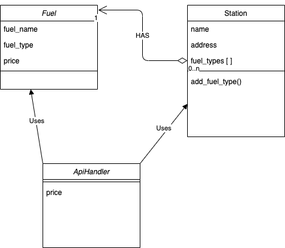
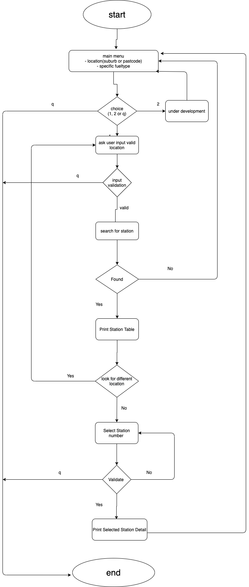
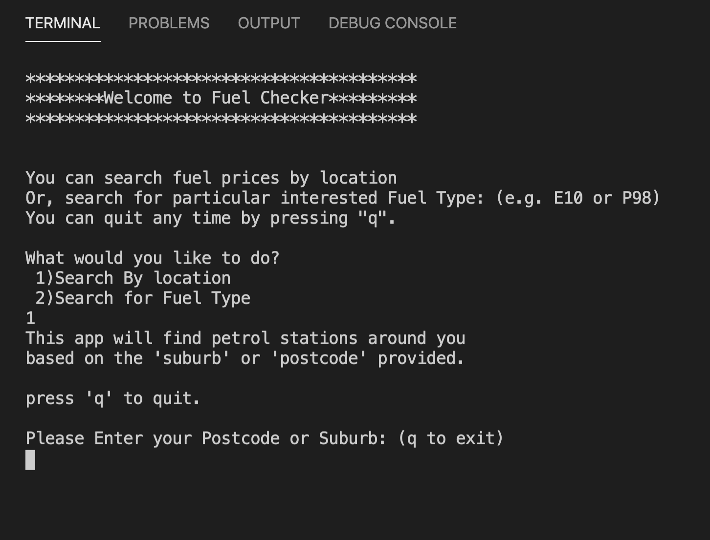
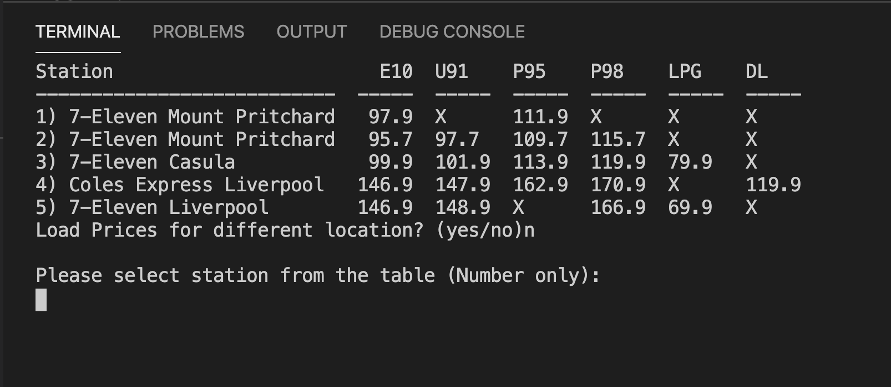
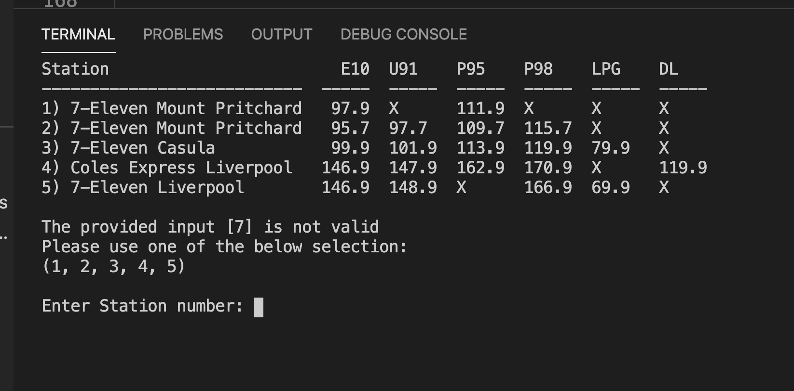
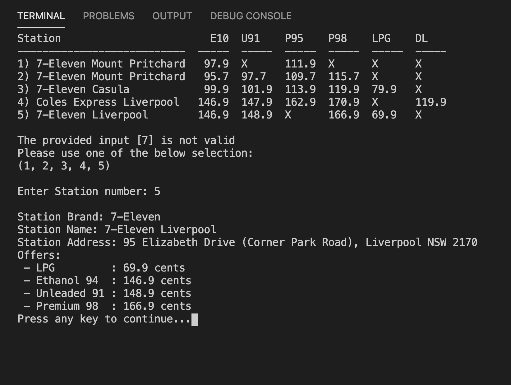

# Terminal Fuel App

### a simple fuel stations check app created with python

## Introduction

This Fuel App is a terminal app which requires the users to login to the app server via **ssh**. The application uses Web Services provided by [NSW Government](https://api.nsw.gov.au/Product/Index/22) called [Fuel API](https://api.nsw.gov.au/Product/Index/22). 

This application can provided:

1. Petrol Station Details
2. Fuel Prices offered

Relative to the location provided by the user. 

Users are required to provide either:

1. Suburb Name (NSW only)
2. Postal Code (NSW Delivery Area)

Then the application will make a call the REST API provided by NSW Government and parses the returned **JSON** response and displays the users the nearby stations with the fuel prices in table format.

The application validates the location data provided. The application comes with a **csv** file which contains the entire Postal Services details in Australia obtained from AUSPost. Given input is validated for:

- State - NSW
- Delivery Area (**no** PO Boxes, e.g.)

If the given _postcode_ or _suburb_ is not found in the **csv** file, then the user is asked to provide valided data again.

User is given an option to quit the application anytime by entering '**q**'. 

## Technologies

The language I have used and libraries and its versions are listed below:

- python 3.8
  - requests
  - tabulate
- Git
  - Version controlling
- GitHub
  - CI/CD
- AWS 
  - Hosting

### Python

The entire application is written in **Python (v3.8)**. In this project, the Object Oriented paradigm is implemented:

There are three classes as shown above:

- Station
- Fuel
- ApiHandler

#### Station

The **station** class defines the properties of a station:

- Station Name
- Station Addresss
- Fuel Types it offers (E10, P95, Diesel)

The **Fuel Types** property is a list and it is designed to contains only the type **Fuel** which is described blow.

#### Fuel

The **Fuel** class defines the properties of a single Fuel:

- Name of the Fuel (Ethanol 10%)
- Code of the Fuel (E10)
- The price of the Fuel (in AU Cents)

#### ApiHandler

The **ApiHandler** class is designed to handle all REST API calls and parsing steps which will abstract away the complexity of the calls and parsings from the callers. 

This class uses the **requests** module mainly to make **HTTP** calls the Web Service Provide: NSW Government.

#### main()

The **main** file is the entry point and **UI** of the applicaiton. It handles all user inputs:

-  Validating the inputs
- navigating the application

This **main** files also uses a module (third party) called [Tabulate](https://pypi.org/project/tabulate/) which helps to print very nice tables. Using this modules functions, this app is able to present the stations and its fuel types along with the prices to the user. 

### Flowchart

Here is flowchart which helps the users to have an overview on how this application is designed to be interacted:

### Screeshots

#### Start

#### Show price table

#### Invalid Selection

#### Show Station Details if selected correct

## GIT

During development, the code changes are versioned using **Git** and published in my [GitHub](https://github.com/habibah-adam/fuel_app) account. This app also utilises the [GitHub Actions](https://docs.github.com/en/free-pro-team@latest/actions) to run the test cases (Python Unittest) to validate the parts of the application before its deployment. 

The usage of the GitHub Actions is also a way of demonstration of the CI/CD knowledge. 

### Deployment

Using GitHub Actions, the **Deployment** part is also integrated in the process. A AWS EC2 instance is created to host this Terminal Application and the GitHub Actions is configured to deploy the application to EC2 if:

- A commit to **master** branch occurs
- The Test Suite Passes 

